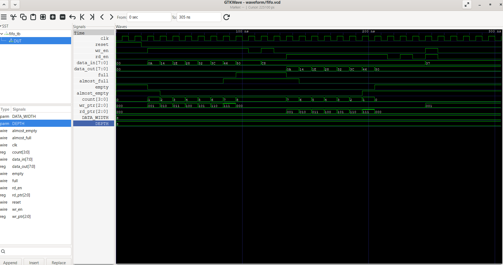

# Synchronous FIFO using Verilog HDL

## Overview

This project implements a parameterized **Synchronous First-In First-Out (FIFO)** memory using **Verilog HDL**. The FIFO stores data in the order it is received and retrieves it in the same order while operating under a single clock domain.

The design uses a circular buffer architecture with read and write pointers, supports configurable data width and depth, and includes status flags for efficient buffer management.

---

## Features

* Parameterized Data Width
* Parameterized FIFO Depth
* Circular Buffer Implementation
* Read Pointer
* Write Pointer
* Count Register
* Full Flag
* Empty Flag
* Almost Full Flag
* Almost Empty Flag
* Pointer Wrap-around
* Verified using Icarus Verilog
* Waveform generated using GTKWave

---

## Project Structure

```
Synchronous_FIFO_Verilog/
│
├── fifo.v
├── fifo_tb.v
├── README.md
├── LICENSE
│
└── waveform/
    ├── fifo.vcd
    └── fifo_waveform.png
```

---

## FIFO Operation

The FIFO operates synchronously using a single clock.

### Write Operation

* Data is written when `wr_en` is asserted.
* Data is stored at the location pointed to by the write pointer.
* The write pointer increments after every successful write.

### Read Operation

* Data is read when `rd_en` is asserted.
* The oldest stored data is returned.
* The read pointer increments after every successful read.

### Status Flags

| Flag         | Description                          |
| ------------ | ------------------------------------ |
| Full         | FIFO cannot accept new data          |
| Empty        | FIFO contains no valid data          |
| Almost Full  | FIFO has only one location remaining |
| Almost Empty | FIFO contains only one data element  |

---

## Verification

The following test cases were verified:

* Reset Operation
* Sequential Write
* Sequential Read
* FIFO Full Condition
* FIFO Empty Condition
* Almost Full Detection
* Almost Empty Detection
* Pointer Wrap-around
* Simultaneous Read and Write

---

## Simulation Waveform



---

## Tools Used

* Verilog HDL
* Icarus Verilog
* GTKWave
* Git
* GitHub

---

## Future Improvements

* Asynchronous FIFO
* Dual Clock FIFO
* AXI Stream FIFO
* UART Integration
* FPGA Implementation

---

## Author

**Sheshank Singh Rai**
